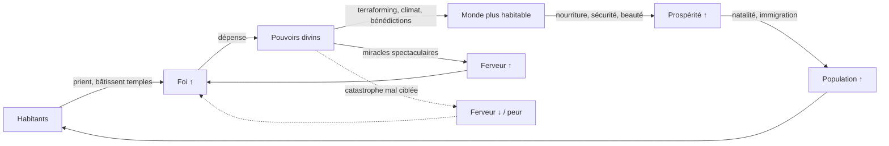

# ImG — Système de Pouvoirs Divins (Game Design Document)

> Chapitre de conception dédié aux miracles du joueur-divinité. Complète le
> GDD principal (`GDD.md`) et le cahier des charges (`CAHIER_DES_CHARGES.md`).
> **Principe cardinal : le joueur influence, il ne contrôle jamais.** Aucun
> pouvoir ne donne d'ordre direct à un habitant ; tout passe par le monde,
> l'environnement ou l'esprit (visions, ferveur).

---

## 0. Résumé exécutif

- **76 pouvoirs originaux** répartis en 9 écoles, chacun avec nom, description, coût, recharge, effets, interactions, avantages/inconvénients et usages.
- **Deux ressources** : la **Foi** (produite par les croyants, dépensée pour agir) et l'**Étincelle divine** (jauge qui se régénère avec le temps réel, réservée aux miracles majeurs — empêche le spam).
- **Progression à 5 niveaux par pouvoir**, chaque niveau débloquant un **nouvel effet** (jamais un simple +%), avec une **bifurcation stratégique** aux niveaux 3 et 5 (deux spécialisations exclusives).
- **Boucle de Foi** auto-entretenue : croyants → Foi → miracles → monde prospère → plus de croyants.
- **Mécaniques émergentes** : chaque pouvoir modifie des variables partagées (humidité, altitude, fertilité, peur, ferveur, ressources), si bien que les combinaisons produisent des résultats non scriptés (ex. *séisme + rivière = nouveau lac*).

---

## 1. Les ressources divines

### 1.1 La Foi (ressource principale)
Produite par les croyants, dépensée pour la plupart des pouvoirs.

```
foi/tick = Σ_habitants ( ferveur × productivité_spirituelle × mod_temple × mod_fête )
```

| Facteur | Plage | Source |
|---|---|---|
| `ferveur` | 0 – 3 | opinion de l'habitant envers le dieu (miracles vus, dogmes) |
| `productivité_spirituelle` | 0,02 – 0,08 /tick | de base ; augmentée par prêtres |
| `mod_temple` | ×1 – ×4 | temples et lieux saints à portée |
| `mod_fête` | ×1 – ×6 | jours sacrés, prophéties accomplies |

**Réserve** plafonnée (extensible par temples/reliques). La Foi peut devenir **négative en réputation** : un miracle raté ou une catastrophe attribuée au dieu fait chuter la ferveur → spirale de déclin.

### 1.2 L'Étincelle divine (ressource de tempo)
Jauge unique (0–100) qui se **régénère avec le temps réel** (≈ +1 / 3 s de base, améliorable). Les pouvoirs **cosmiques et catastrophiques** en consomment en plus de la Foi. Elle empêche l'enchaînement de miracles dévastateurs même si le joueur croule sous la Foi. C'est le vrai levier d'équilibrage des pouvoirs de fin de partie.

### 1.3 La recharge (cooldown)
Chaque pouvoir a un temps de recharge **individuel**. Trois familles :
- **Continu** (terraforming léger, murmures) : recharge nulle ou quasi, coût par application.
- **Cyclique** (météo, bénédictions) : recharge courte à moyenne (10 s – 3 min).
- **Événementiel** (catastrophes, cosmique) : recharge longue (5 – 30 min) + coût d'Étincelle.

---

## 2. La boucle de gameplay (économie de Foi)



**Tension centrale** : les pouvoirs les plus puissants (catastrophes) sont à double tranchant — ils résolvent une menace mais effraient les fidèles. La maîtrise consiste à **transformer la peur en ferveur** (frapper un ennemi du peuple, pas le peuple).

**Rythme d'une partie** : le dieu commence avec 3 pouvoirs (Soulèvement, Ondée, Songe). Chaque palier de **dévotion cumulée** débloque de nouveaux miracles (voir §12). Un monde florissant finit par ouvrir les pouvoirs cosmiques.

---

## 3. Le système de progression (5 niveaux)

Règle universelle : **chaque niveau débloque un effet qualitatif nouveau**, et les niveaux **3 et 5 sont des bifurcations** (choix exclusif → deux « voies » du pouvoir). On ne monte pas un pouvoir « pour +10 % » mais pour **changer ce qu'il fait**.

### 3.1 Gabarit d'arbre (appliqué à chaque pouvoir)

```
        L1  effet de base
         │
        L2  + effet secondaire (élargit le champ)
         │
        L3  ◈ BIFURCATION  ── Voie A ────┐
         │                  └─ Voie B ──┐│
        L4  + effet renforçant la voie choisie
         │
        L5  ◈ BIFURCATION FINALE (capacité signature)
```

### 3.2 Exemple complet — **Ondée → Déluge** (pluie)

| Niv. | Nom du palier | Déblocage (effet, pas stat) |
|---|---|---|
| 1 | Ondée | Sature les nuages d'une zone → pluie → humidité du sol ↑. |
| 2 | Pluie nourricière | La pluie **accélère la croissance** de la flore et des cultures sous l'averse. |
| 3A | **Voie de la Vie** | La pluie fait **germer** spontanément prairies et bosquets sur sol nu viable. |
| 3B | **Voie de l'Orage** | La pluie peut monter en **orage** : éclairs aléatoires (dégâts/feu) mais ferveur ↑. |
| 4 | (selon voie) | Vie : rosée de fertilité (natalité animale ↑). Orage : la foudre allume des feux de forêt contrôlables. |
| 5A | **Mousson** | Déclenche une saison des pluies régionale auto-entretenue (climat humide durable). |
| 5B | **Tempête matricielle** | Un orage mobile que le joueur guide au doigt, laissant une terre détrempée fertile derrière lui. |

Ce modèle (base → élargissement → 2 voies → renfort → 2 signatures) s'applique aux 76 pouvoirs. Les tableaux du §11 donnent, pour chaque pouvoir, sa ligne « L1→L5 » condensée.

### 3.3 Coût de progression
Les niveaux se paient en **Dévotion** (Foi cumulée à vie) + parfois un **prérequis de monde** (ex. « avoir un temple de niveau 2 » pour débloquer L5 spirituel). Barème indicatif :

| Niveau | Coût Dévotion | Prérequis type |
|---|---|---|
| L2 | 1× base | avoir utilisé le pouvoir N fois |
| L3 | 3× base | palier d'ère technologique |
| L4 | 6× base | édifice ou événement mondial |
| L5 | 12× base | accomplissement (prophétie, population, etc.) |

---

## 4. École I — Géomancie (terrain)

> Modifie les variables partagées `altitude`, `humidité`, `biome`, laisse des **traces permanentes**. Base du jeu, faible coût, recharge quasi nulle → outil de sculpture continue.

### Carte détaillée — **Orogenèse** (créer une montagne)
- **Nom** : *Orogenèse — le Réveil des Racines*
- **Description** : « D'un geste, tu ordonnes à la pierre endormie de croître vers le ciel. La terre gronde, se plisse, et une montagne naît là où régnait la plaine. »
- **Coût** : 40 Foi + 3 Foi / mètre d'élévation.  **Recharge** : 6 s.
- **Effets** : élève un cône de terrain ; au-delà d'un seuil d'altitude, neige et roche apparaissent (climat par altitude). Crée des **versants** qui redirigent l'eau et l'humidité (ombre pluviométrique derrière la montagne).
- **Interactions** : + *Ondée* = versant au vent luxuriant / versant sous le vent aride. + *Lit du Serpent* = source de rivière en altitude. + *Réveil du Titan* = volcan.
- **Avantages** : barrière naturelle contre invasions et tsunamis ; gisements de minerai en profondeur. **Inconvénients** : coupe les routes, isole des villages, refroidit le climat local.
- **Meilleur usage** : protéger une vallée, forcer un climat, préparer l'exploitation minière.
- **Progression** : L1 colline → L2 chaîne (traçable) → **L3A** pics enneigés (eau douce) / **L3B** plateau habitable → L4 filons de minerai révélés → **L5A** *Toit du Monde* (climat régional refroidi durablement) / **L5B** *Citadelle de Pierre* (le plateau devient un site défensif prisé, ferveur des bâtisseurs).

### Carte détaillée — **Reforge** (remodeler une région)
- **Nom** : *Reforge — la Main du Potier*
- **Description** : « Tu prends la région comme argile et lui rends la forme de ton rêve. »
- **Coût** : très élevé (Foi ∝ surface³) + 20 Étincelle.  **Recharge** : 8 min.
- **Effets** : ouvre un **mode pinceau macro** (élever/abaisser/aplanir/river sur une grande zone en un miracle continu tant que l'Étincelle tient).
- **Interactions** : combine tous les pouvoirs de terrain ; sert de « toile » avant d'invoquer forêts, rivières, sanctuaires.
- **Avantages** : transformation d'ampleur en une session. **Inconvénients** : traumatise les habitants (déplacements forcés, peur) ; ruine les cultures existantes.
- **Meilleur usage** : refonte d'un continent de départ, réparation post-catastrophe.

**Tableau de l'école I** — voir §11.1.

---

## 5. École II — Climatomancie (nature)

> Agit sur `humidité`, `température`, `saison`, `vent`, `flore`. Cyclique. Le cœur du « monde vivant ».

### Carte détaillée — **Roue des Saisons**
- **Nom** : *Roue des Saisons — le Souffle de l'Année*
- **Description** : « Tu fais tourner la grande roue : l'hiver cède au printemps, ou le gel descend avant l'heure. »
- **Coût** : 120 Foi + 10 Étincelle.  **Recharge** : 4 min.
- **Effets** : avance ou recule la saison d'une région (décalage thermique). Le printemps relance la croissance ; l'hiver stoppe la flore et gèle l'eau peu profonde.
- **Interactions** : hiver + *Grand Tarissement* = famine (arme contre un ennemi). Printemps + *Sève Vive* = explosion agricole. Hiver forcé éteint les *feux de forêt*.
- **Avantages** : contrôle des récoltes, arme climatique, extinction d'incendies. **Inconvénients** : un hiver mal placé affame **vos** fidèles ; désynchronise les animaux migrateurs.
- **Meilleur usage** : sauver une récolte, punir une région rebelle, gérer une crise (feu, sécheresse).
- **Progression** : L1 nudge d'une demi-saison → L2 saison complète → **L3A** *Éternel Printemps* (verrou doux sur une région) / **L3B** *Cœur de l'Hiver* (arme de gel) → L4 la transition libère un pic de ferveur (« le dieu commande le ciel ») → **L5A** *Année Parfaite* (cycle optimisé rendement) / **L5B** *Long Hiver* (hiver volcanique régional, siège climatique).

**Tableau de l'école II** — §11.2.

---

## 6. École III — Courroux (catastrophes divines)

> **Traces permanentes obligatoires** : chaque catastrophe grave le monde (cratère, caldeira, cicatrice de faille, forêt calcinée). Coût élevé + Étincelle. À double tranchant sur la ferveur.

### Carte détaillée — **Réveil du Titan** (éruption volcanique)
- **Nom** : *Réveil du Titan — le Cœur de Feu*
- **Description** : « Sous la montagne dort un titan. Tu le réveilles. La terre saigne du feu, et le monde s'en souviendra pour mille ans. »
- **Coût** : 600 Foi + 45 Étincelle.  **Recharge** : 20 min.
- **Effets** : transforme une montagne en volcan ; coulées de lave (destruction totale sur leur passage, traces permanentes de roche volcanique) ; **cendres → sol ultra-fertile** après refroidissement ; nuage de cendres refroidit le climat régional temporairement.
- **Interactions** : + *Vague Léviathane* = nouvelles terres (lave + mer = roche/île). Lave + *Ondée* = refroidissement accéléré, obsidienne (ressource). + *Grand Tarissement* = propagation d'incendies.
- **Avantages** : arme ultime ; fertilise durablement (après coup) ; crée un lieu de terreur sacrée (ferveur si ciblé sur un ennemi). **Inconvénients** : peut engloutir vos propres villages ; famine par l'hiver volcanique.
- **Meilleur usage** : détruire une capitale ennemie, créer à long terme le grenier le plus riche du monde, sculpter de nouvelles terres avec la mer.
- **Progression** : L1 éruption ponctuelle → L2 coulées dirigeables → **L3A** *Terre Noire* (fertilité maximale post-éruption) / **L3B** *Forge du Titan* (gisements d'obsidienne/métaux) → L4 le volcan devient récurrent (menace/ressource permanente) → **L5A** *Île de Feu* (usine à terres neuves avec la mer) / **L5B** *Autel du Titan* (le volcan devient un lieu saint, sacrifices → Foi massive).

### Carte détaillée — **Larme du Ciel** (météorite)
- **Nom** : *Larme du Ciel*
- **Description** : « Une étoile se détache et tombe où pointe ton doigt. »
- **Coût** : 500 Foi + 40 Étincelle.  **Recharge** : 15 min.
- **Effets** : impact → cratère permanent, onde de choc (destruction radiale), **gisement de métal céleste** au centre (ressource rare et convoitée → guerres, commerce). Poussière → hiver bref.
- **Interactions** : cratère + *Bassin* = lac de cratère sacré. Métal céleste alimente l'*évolution technologique* (bond d'ère) et attire les marchands.
- **Avantages** : précision, crée une ressource légendaire. **Inconvénients** : la ressource déclenche des convoitises (guerres émergentes — voulues ou non).
- **Meilleur usage** : offrir un « trésor » qui remodèle la géopolitique ; frappe chirurgicale.

**Tableau de l'école III** — §11.3.

---

## 7. École IV — Grâces (bénédictions)

> Buffs positifs sur zones/villages : `fertilité`, `santé`, `productivité`, `chance`. Peu de traces permanentes, forte valeur relationnelle (ferveur).

### Carte détaillée — **Corne d'Abondance**
- **Nom** : *Corne d'Abondance*
- **Description** : « Les champs ploient sous le grain, les vergers débordent : nul n'aura faim cette saison. »
- **Coût** : 90 Foi.  **Recharge** : 90 s.
- **Effets** : ×2–×4 rendement agricole d'une zone pour une saison ; surplus → **croissance démographique** et **commerce** (émergence de marchés).
- **Interactions** : + *Ondée* et sol fertile (post-volcan) = récolte record → boom de population → Foi ↑ (boucle vertueuse). Surplus attire migrations (*Exode* inversé).
- **Avantages** : moteur de la boucle de croissance ; ferveur élevée. **Inconvénients** : surpopulation → tensions, épuisement des sols si abusé (fertilité ↓ à terme).
- **Meilleur usage** : lancer une civilisation, relancer après une famine, préparer un afflux de fidèles.
- **Progression** : L1 buff local → L2 s'étend aux vergers/pêche → **3A** *Grenier du Monde* (stock national, résilience aux famines) / **3B** *Fête des Moissons* (récolte = jour sacré, ferveur ↑↑) → L4 le surplus finance des temples automatiquement → **5A** *Terre Nourricière* (fertilité permanente sans épuisement) / **5B** *Abondance Contagieuse* (les villages voisins imitent les techniques agricoles → diffusion technologique).

**Tableau de l'école IV** — §11.4.

---

## 8. École V — Murmures (influence des habitants)

> **Jamais de contrôle direct.** Modifie des variables psychologiques (`courage`, `foi`, `curiosité`, `peur`, `objectif suggéré`) qui **pondèrent** l'IA utilitaire — l'habitant reste libre de suivre ou non.

### Carte détaillée — **Appel du Lointain** (inspirer une destination)
- **Nom** : *Appel du Lointain*
- **Description** : « Tu plantes dans les cœurs le désir d'un ailleurs. Certains partiront ; tu ne sais jamais lesquels. »
- **Coût** : 70 Foi.  **Recharge** : 45 s.
- **Effets** : marque un lieu comme « désirable » ; augmente la **probabilité** que des habitants aventureux migrent/explorent vers lui (via l'utilité, pas un ordre). Renforcé si le lieu est réellement attractif (ressources, sanctuaire).
- **Interactions** : + *Source Sacrée*/*Corne d'Abondance* au point cible = colonisation réussie. + *Songe* = pèlerinage. Sur un lieu dangereux = exode risqué (émergence dramatique).
- **Avantages** : peupler de nouvelles terres, désengorger, lancer l'expansion. **Inconvénients** : imprévisible (qui part ? combien ?) ; peut vider un village utile.
- **Meilleur usage** : coloniser une île neuve, guider vers une terre promise, disperser une population en surnombre.
- **Progression** : L1 attrait faible → L2 forme des **caravanes** (groupes) → **3A** *Terre Promise* (migration de masse ciblée) / **3B** *Pèlerinage* (déplacement spirituel → temple, ferveur ↑) → L4 les migrants fondent spontanément un nouveau village → **5A** *Diaspora* (essaimage de plusieurs colonies) / **5B** *Nation en Marche* (un peuple entier suit une prophétie de destination).

### Carte détaillée — **Onction** (faire naître un prophète)
- **Nom** : *Onction — l'Élu*
- **Description** : « Tu poses la main sur une âme ordinaire et en fais une voix. »
- **Coût** : 200 Foi.  **Recharge** : 5 min.
- **Effets** : élève un habitant au rang de **prophète** : rayonne de la ferveur autour de lui, accélère la conversion, peut fonder une religion structurée, unifier des villages. Le prophète a sa **propre volonté** (peut dévier du dogme → schisme émergent !).
- **Interactions** : + *Augure* (prophétie) = mouvement religieux puissant. + *Révélation* = conversion éclair. Deux prophètes rivaux = guerre de religion émergente.
- **Avantages** : démultiplie la Foi, unifie, structure la religion. **Inconvénients** : un prophète charismatique peut **réinterpréter** vos miracles (perte de contrôle du dogme), voire prôner l'hérésie.
- **Meilleur usage** : unifier un peuple divisé, catalyser une conversion, incarner durablement votre présence.

**Tableau de l'école V** — §11.5.

---

## 9. Écoles VI à IX (survol + cartes signatures)

### École VI — Édifications (créations divines)
Objets permanents posés sur le monde, chacun émettant une **aura de variables** (ferveur, fertilité, attractivité, ressources).

Carte signature — **Arbre-Monde** (*arbre sacré*) : arbre colossal permanent ; aura de fertilité + ferveur ; devient lieu de pèlerinage et cœur d'une religion animiste. Interactions : + *Source Sacrée* = bosquet sacré (Foi passive) ; abattre l'Arbre-Monde (par un ennemi) = traumatisme national (guerre de vengeance émergente). Progression : L1 arbre → L3A verger nourricier / L3B oracle (visions gratuites) → L5A *Forêt-Mère* (reboise un continent) / L5B *Arbre des Âges* (mémoire du monde : renforce la transmission des dogmes).

### École VII — Mystères (spirituels)
Le levier de la **Foi** elle-même et des entités divines.

Carte signature — **Séraphin Gardien** (*ange protecteur*) : invoque une entité qui **patrouille** une zone, repousse prédateurs/pillards, inspire un courage extrême. Ne combat pas « sur ordre » : réagit aux menaces. Interactions : + *Égide Divine* = zone inviolable ; face à une *Bête de Légende* ennemie = duel mythique. Inconvénients : coûte de la Foi en entretien (présence continue). Progression → L5A *Légion Céleste* (plusieurs gardiens) / L5B *Ange Déchu* (si mal nourri en Foi, se retourne — risque émergent).

Carte signature — **Chœur des Fidèles** (*multiplier la Foi*) : transforme temporairement toute prière en Foi démultipliée. La ressource de « burst » économique.

### École VIII — Bestiaire (faune et créatures)
Peuple le monde de vie animale (variables `population animale`, `ressource gibier/poisson`, écosystème).

Carte signature — **Bête de Légende** (*créature légendaire*) : invoque une créature mythique unique (dragon, léviathan, cerf d'or…). Devient un **acteur du monde** : objet de crainte, de chasse héroïque, ou totem d'un peuple. Interactions : totem = ferveur d'un peuple entier ; relâchée hostile = fléau (les héros locaux tentent de l'abattre → légendes émergentes). Progression → L5A *Gardienne du Monde* (protège un biome entier) / L5B *Fléau Sacré* (arme vivante dirigée contre un ennemi).

### École IX — Apothéose (cosmiques / fin de partie)
Les grands leviers, très coûteux en **Étincelle**, débloqués tard.

Carte signature — **Suspens** (*arrêter le temps*) : gèle la simulation des habitants/animaux pendant que le dieu terraforme/agit librement. Fenêtre de « planification divine ». Interactions : permet des combos autrement impossibles (déplacer une montagne pendant que nul ne fuit). Coût énorme d'Étincelle. Progression → L5A *Instant Éternel* (fenêtre longue) / L5B *Remontée* (annule les N derniers ticks — « repentir divin », coûteux).

Carte signature — **Genèse** (*créer une nouvelle île*) : fait surgir de l'océan une île vierge, prête à coloniser (via *Appel du Lointain*). La respiration long-terme du monde.

Carte signature — **Métamorphose** (*transformer totalement une région*) : réécrit biome + climat + relief + faune d'une région en un thème choisi (désert de verre, jungle primordiale, toundra cristalline…). L'expression ultime du pouvoir créateur.

---

## 10. Mécaniques émergentes — matrice d'interactions

Chaque pouvoir écrit dans des **variables partagées** ; les combinaisons produisent des effets non scriptés. Extrait :

| Pouvoir A | Pouvoir B | Résultat émergent |
|---|---|---|
| Réveil du Titan (lave) | Vague Léviathane (mer) | Nouvelle terre volcanique / île |
| Orogenèse (montagne) | Ondée (pluie) | Versants au vent fertiles / désert d'ombre pluviométrique |
| Colère Tellurique (séisme) | Lit du Serpent (rivière) | Barrage effondré → nouveau lac |
| Grand Tarissement (sécheresse) | Foudre du Jugement | Feu de forêt qui se propage |
| Corne d'Abondance | Appel du Lointain | Boom démographique → vague de colonisation |
| Onction (prophète) × 2 | — | Schisme → guerre de religion |
| Larme du Ciel (métal) | (aucun) | Convoitise → guerres et routes commerciales |
| Roue des Saisons (hiver) | Réveil du Titan (cendres) | Hiver volcanique → famine régionale |
| Arbre-Monde | Source Sacrée | Bosquet sacré → Foi passive |
| Métamorphose (jungle) | Bête de Légende | Écosystème mythique auto-suffisant |

**Principe de conception** : on n'écrit jamais « si A et B alors C » en dur. On modélise A et B comme des modifications de variables physiques/sociales, et **C émerge** de la simulation. C'est ce qui rend le système plus profond que Godus/B&W.

---

## 11. Tableaux d'équilibrage (les 76 pouvoirs)

**Légende tiers** : T1 (outil continu, très bas coût) · T2 (cyclique) · T3 (majeur) · T4 (événementiel lourd) · T5 (cosmique).
Coûts en Foi ; « É » = Étincelle divine ; recharge indicative au niveau 1.

### 11.1 Géomancie (terrain)
| # | Pouvoir | Tier | Coût | Rech. | Effet clé | L1→L5 (résumé) |
|---|---|---|---|---|---|---|
| 1 | Soulèvement | T1 | 8/appli | — | élève le sol | portée → biseaux → 3A précision/3B volume → 5A colonne/5B faille |
| 2 | Affaissement | T1 | 8/appli | — | abaisse le sol | idem miroir ; 5B → gouffre |
| 3 | Orogenèse | T2 | 40+ | 6 s | montagne (voir §4) | colline→chaîne→3A neige/3B plateau→5A climat/5B citadelle |
| 4 | Faille | T2 | 50 | 8 s | falaise/vallée | mur→canyon→3A défensif/3B fertile→5 rift |
| 5 | Lit du Serpent | T2 | 45 | 5 s | rivière/canyon | ruisseau→fleuve→3A irrigation/3B navigable→5 delta |
| 6 | Bassin | T2 | 55 | 8 s | lac/mer | mare→lac→3A eau douce/3B mer→5 mer intérieure |
| 7 | Enfantement des Îles | T3 | 180 | 90 s | île | îlot→archipel→3A refuge/3B avant-poste→5 continent |
| 8 | Grand Assèchement | T3 | 120 | 60 s | assèche | flaque→marais→3A terres arables/3B désert→5 fond marin révélé |
| 9 | Souffle des Cavernes | T2 | 60 | 12 s | grottes | abri→réseau→3A minerai/3B sanctuaire souterrain→5 monde souterrain |
| 10 | Arche de Pierre | T2 | 40 | 6 s | pont naturel | passage→route→3A aqueduc/3B rempart→5 viaduc monumental |
| 11 | Reforge | T4 | ∝surf +20É | 8 min | pinceau macro (voir §4) | — |

### 11.2 Climatomancie (nature)
| # | Pouvoir | Tier | Coût | Rech. | Effet clé | L1→L5 |
|---|---|---|---|---|---|---|
| 12 | Ondée | T2 | 60 | 15 s | pluie (voir §3.2) | — |
| 13 | Grand Tarissement | T3 | 110 | 60 s | sécheresse | assèche→stérilise→3A anti-feu inversé/3B arme famine→5 aridification durable |
| 14 | Roue des Saisons | T3 | 120+10É | 4 min | change saison (§5) | — |
| 15 | Sylve Nouvelle | T2 | 80 | 20 s | forêts | bosquet→forêt→3A verger/3B bois dense→5 forêt primordiale |
| 16 | Éclosion | T1 | 30 | 8 s | prairies fleuries | fleurs→pollinisateurs→3A miel/ressource/3B beauté(ferveur)→5 prairie éternelle |
| 17 | Sève Vive | T2 | 50 | 15 s | croissance cultures ×N | +vitesse→+rendement→3A précoce/3B robuste→5 moisson perpétuelle |
| 18 | Microclimat | T3 | 130 | 3 min | climat régional | tempère→humidifie→3A oasis/3B tempéré→5 verrou climatique |
| 19 | Souffle d'Éole | T2 | 40 | 10 s | vent | pousse nuages→pollen/graines→3A navigation/3B disperse feu/nuages→5 alizés permanents |

### 11.3 Courroux (catastrophes) — *traces permanentes*
| # | Pouvoir | Tier | Coût | Rech. | Effet clé | L1→L5 |
|---|---|---|---|---|---|---|
| 20 | Foudre du Jugement | T2 | 70 | 20 s | éclair ciblé | frappe→feu→3A précision(exécution)/3B chaîne→5 tempête de foudre |
| 21 | Déluge | T3 | 200 | 3 min | tempête/inondation | pluie violente→crue→3A crue fertile/3B destruction→5 déluge biblique |
| 22 | Danse de Typhon | T3 | 220 | 3 min | tornade mobile | arrache→déplace objets→3A dirigeable/3B multiple→5 super-cellule |
| 23 | Colère Tellurique | T4 | 300+25É | 8 min | séisme (faille permanente) | secousse→crevasses→3A ciblé/3B tsunamigène→5 grand rift |
| 24 | Réveil du Titan | T4 | 600+45É | 20 min | volcan (voir §6) | — |
| 25 | Vague Léviathane | T4 | 350+30É | 10 min | tsunami | vague→érosion côtière→3A ciblée/3B terres neuves(+lave)→5 raz mondial |
| 26 | Linceul Blanc | T3 | 180 | 3 min | avalanche | coulée→ensevelit→3A barrage/3B arme→5 glacier |
| 27 | Larme du Ciel | T4 | 500+40É | 15 min | météorite (voir §6) | — |
| 28 | Blizzard Éternel | T3 | 200 | 4 min | tempête de neige | gel→immobilise→3A conservation/3B siège→5 ère glaciaire locale |

### 11.4 Grâces (bénédictions)
| # | Pouvoir | Tier | Coût | Rech. | Effet clé | L1→L5 |
|---|---|---|---|---|---|---|
| 29 | Corne d'Abondance | T2 | 90 | 90 s | récoltes ×N (voir §7) | — |
| 30 | Bénédiction de Fécondité | T2 | 100 | 2 min | natalité ↑ (gens+bêtes) | +naissances→3A humains/3B faune→5 baby-boom régional |
| 31 | Main Guérisseuse | T2 | 80 | 45 s | soigne maladie/blessure | soin→3A épidémie stoppée/3B immunité→5 santé parfaite régionale |
| 32 | Égide Divine | T2 | 120 | 2 min | bouclier anti-catastrophe/ennemi | protège→3A anti-nature/3B anti-guerre→5 sanctuaire inviolable |
| 33 | Étincelle de Génie | T3 | 150 | 3 min | bond de découverte tech | idée→3A militaire/3B civile→5 renaissance |
| 34 | Ferveur Bâtisseuse | T1 | 40 | 20 s | construction accélérée | +vitesse→3A monuments/3B habitat→5 cité en un jour |
| 35 | Faveur du Sort | T1 | 30 | 30 s | chance (évite accidents) | +chance→3A récolte/3B combat→5 âge béni |
| 36 | Âge d'Or | T4 | 400+20É | 10 min | prospérité globale régionale | boom multi-variables→5 utopie durable |

### 11.5 Murmures (habitants) — *jamais de contrôle direct*
| # | Pouvoir | Tier | Coût | Rech. | Effet clé | L1→L5 |
|---|---|---|---|---|---|---|
| 37 | Cœur de Lion | T1 | 35 | 20 s | courage ↑ (moins de fuite) | +courage→3A guerre/3B exploration→5 héroïsme collectif |
| 38 | Appel du Lointain | T2 | 70 | 45 s | inspire destination (voir §8) | — |
| 39 | Murmure | T1 | 25 | 10 s | biais de décision léger | nudge→3A travail/3B social→5 volonté commune |
| 40 | Révélation | T2 | 90 | 60 s | foi ↑ (conversion douce) | +foi→3A éclair/3B durable→5 éveil régional |
| 41 | Parole d'Apaisement | T2 | 80 | 60 s | calme une révolte/panique | apaise→3A anti-émeute/3B anti-guerre→5 paix imposée |
| 42 | Exode | T3 | 140 | 2 min | migration de masse | départ→3A ciblé/3B fuite→5 nation en marche |
| 43 | Songe | T1 | 30 | 15 s | vision à un habitant | signe→3A prophétique/3B pratique(savoir)→5 rêve partagé |
| 44 | Onction | T3 | 200 | 5 min | prophète (voir §8) | — |
| 45 | Augure | T3 | 160 | 3 min | prophétie (objectif national) | présage→3A espoir/3B crainte→5 destin scellé |

### 11.6 Édifications (créations)
| # | Pouvoir | Tier | Coût | Rech. | Effet clé | L1→L5 |
|---|---|---|---|---|---|---|
| 46 | Source Sacrée | T2 | 90 | 60 s | eau + aura ferveur | source→3A oasis/3B guérisseuse→5 fleuve sacré |
| 47 | Arbre-Monde | T3 | 220 | 3 min | arbre sacré (voir §9) | — |
| 48 | Menhir | T1 | 60 | 30 s | borne d'aura (ferveur/territoire) | +aura→3A calendrier/3B ley-line→5 cercle mégalithique |
| 49 | Autel | T2 | 110 | 90 s | sanctuaire (mini-temple) | prière→3A sacrifice/3B refuge→5 haut-lieu |
| 50 | Grand Temple | T3 | 300 | 4 min | temple (×Foi majeure) | ×Foi→3A pèlerinage/3B clergé→5 basilique |
| 51 | Vestiges | T2 | 100 | 2 min | ruines antiques (mystère, tech) | énigme→3A savoir/3B trésor→5 cité perdue |
| 52 | Veine du Monde | T2 | 90 | 90 s | gisement de ressources | minerai→3A rare/3B renouvelable→5 filon inépuisable |
| 53 | Fontaine des Vœux | T3 | 170 | 3 min | fontaine magique (buffs aléatoires) | vœu→3A chance/3B soin→5 miracle mineur gratuit |

### 11.7 Mystères (spirituels)
| # | Pouvoir | Tier | Coût | Rech. | Effet clé | L1→L5 |
|---|---|---|---|---|---|---|
| 54 | Chœur des Fidèles | T3 | 150 | 3 min | ×Foi temporaire | burst→3A durée/3B intensité→5 extase collective |
| 55 | Grande Conversion | T3 | 200 | 4 min | convertit un village | conversion→3A pacifique/3B fervente→5 conversion de royaume |
| 56 | Prodige | T2 | 120 | 2 min | miracle mineur gratuit ciblé | signe→3A vie/3B nature→5 grand prodige |
| 57 | Séraphin Gardien | T3 | 180+entretien | 4 min | ange protecteur (voir §9) | — |
| 58 | Héraut Ailé | T2 | 90 | 90 s | ange messager (relie villages, diffuse foi/savoir) | message→3A foi/3B diplomatie→5 réseau céleste |
| 59 | Esprit du Foyer | T2 | 100 | 2 min | esprit gardien local (protège/porte-bonheur) | garde→3A récolte/3B foyer→5 génie tutélaire |
| 60 | Relique | T3 | 210 | 4 min | objet sacré transportable (aura mobile) | relique→3A guerre/3B foi→5 relique de légende |
| 61 | Étoile du Berger | T4 | 350+20É | 8 min | étoile sacrée (guide, ralliement mondial) | phare→3A navigation/3B ralliement→5 signe d'unité mondiale |

### 11.8 Bestiaire (faune)
| # | Pouvoir | Tier | Coût | Rech. | Effet clé | L1→L5 |
|---|---|---|---|---|---|---|
| 62 | Harde | T1 | 50 | 30 s | invoque cerfs (gibier) | troupe→3A prolifique/3B robuste→5 grande migration |
| 63 | Banc Argenté | T1 | 50 | 30 s | poissons (pêche) | banc→3A rivière/3B mer→5 eaux poissonneuses |
| 64 | Nuée | T1 | 40 | 20 s | oiseaux (pollinisation, présage) | vol→3A semences/3B messagers→5 ciel vivant |
| 65 | Troupeau | T2 | 90 | 60 s | bétail domesticable | élevage→3A laine/3B lait-viande→5 pastoralisme |
| 66 | Bête de Légende | T4 | 400+30É | 12 min | créature mythique (voir §9) | — |
| 67 | Rareté | T2 | 80 | 90 s | animal rare (valeur, commerce) | espèce→3A précieuse/3B totem→5 faune fabuleuse |
| 68 | Sauvegarde | T1 | 40 | 30 s | protège une espèce (anti-extinction) | garde→3A repeuplement/3B sanctuaire→5 arche vivante |

### 11.9 Apothéose (cosmique)
| # | Pouvoir | Tier | Coût | Rech. | Effet clé | L1→L5 |
|---|---|---|---|---|---|---|
| 69 | Suspens | T5 | 300+60É | 15 min | arrête le temps (voir §9) | — |
| 70 | Célérité | T4 | 150+20É | 3 min | accélère le temps localement | +vitesse→3A croissance/3B usure ennemie→5 flux temporel |
| 71 | Genèse | T5 | 500+50É | 20 min | nouvelle île (voir §9) | — |
| 72 | Marche des Montagnes | T5 | 450+50É | 20 min | déplace une montagne entière | translation→5 chaîne mobile |
| 73 | Grand Œuvre Climatique | T5 | 800+80É | 30 min | climat mondial durable | réchauffe/refroidit le globe→5 terraformation planétaire |
| 74 | Constellation | T4 | 300+30É | 10 min | constellation sacrée (buff mondial permanent selon dessin) | astres→5 zodiaque divin |
| 75 | Porte Céleste | T5 | 600+70É | 25 min | portail (afflux de fidèles/anges, ou fin de partie ascension) | seuil→5 ascension |
| 76 | Métamorphose | T5 | 700+60É | 25 min | transforme totalement une région (voir §9) | — |

---

## 12. Déblocage & courbe de puissance

Les pouvoirs s'ouvrent par **paliers de Dévotion** (Foi cumulée à vie), souvent conditionnés à un **état du monde** (ère technologique, population, édifices). Extrait de la courbe :

| Palier Dévotion | Pouvoirs ouverts (exemples) | Condition de monde |
|---|---|---|
| 0 | Soulèvement, Ondée, Songe | — (départ) |
| 120 | Affaissement, Éclosion, Murmure | 1er village |
| 300 | Orogenèse, Lit du Serpent, Harde, Menhir | âge de pierre affirmé |
| 700 | Sylve Nouvelle, Corne d'Abondance, Autel, Appel du Lointain | agriculture |
| 1 500 | Foudre du Jugement, Source Sacrée, Onction, Révélation | 1er temple |
| 3 000 | Roue des Saisons, Grand Temple, Séraphin Gardien | religion structurée |
| 6 000 | Colère Tellurique, Réveil du Titan, Bête de Légende | âge du bronze/fer |
| 12 000 | Larme du Ciel, Âge d'Or, Étoile du Berger | civilisation avancée |
| 25 000 | Suspens, Genèse, Grand Œuvre Climatique, Porte Céleste | apothéose |

**Anti-frustration** : à tout moment, au moins un pouvoir de chaque « fonction » (sculpter, nourrir, protéger, inspirer) est disponible, pour ne jamais bloquer la boucle.

---

## 13. Cadre d'équilibrage (principes)

1. **Coût ∝ permanence × surface × dangerosité.** Un effet permanent et large coûte cher ; un buff temporaire local est bon marché.
2. **L'Étincelle borne le spam** des T4/T5 indépendamment de la Foi : on ne peut pas raser le monde même riche.
3. **Chaque pouvoir a un contre.** Feu ↔ Ondée/Hiver ; révolte ↔ Apaisement ; catastrophe ↔ Égide ; famine ↔ Corne d'Abondance. Les guerres de religion se règlent par Onction/Grande Conversion.
4. **Le double tranchant est mesuré** par un ratio *ferveur gagnée / ferveur perdue* selon la cible (frapper un ennemi du peuple = +, frapper le peuple = −).
5. **Boucle vertueuse plafonnée** : la surpopulation crée des tensions (maladies, famines, révoltes) pour éviter la croissance infinie sans gestion.
6. **Tests de simulation** : chaque nouveau pouvoir sera livré avec un test headless vérifiant son effet déterministe sur les variables partagées (cf. `tests/sim/powers.test.ts`).

---

## 14. Feuille de route d'implémentation (technique)

L'architecture existante rend l'ajout d'un pouvoir **local** : implémenter l'interface `Power` (`sim/powers/Power.ts`), l'enregistrer, déclarer son seuil dans `ProgressionSystem`. Priorisation :

Le **grimoire** (`src/ui/Grimoire.ts`, onglet 📖 dédié) liste tout le catalogue
(`src/sim/powers/catalog.ts`) groupé par les 9 écoles, avec l'état de chaque
pouvoir (disponible / verrouillé à un seuil de Dévotion / à venir).

1. **Déjà en jeu (22 pouvoirs, effets réels sur les variables partagées)** :
   - *Fléaux (nouvelle école, inspirée de la Sainte Bible)* : **Nuée de Sauterelles** (Exode 10 — dévore la végétation), **Peste du Bétail** (Exode 9 — la faune périt), **Grêle de Feu** (Exode 9 — flore + faune + terre criblée + effroi), **Ténèbres** (Exode 10 — la ferveur s'effondre), **Déluge** (Genèse 7 — nuages saturés + sol engorgé sur une vaste région).
   - *Grâces (ajout biblique)* : **Manne Céleste** (Exode 16 — faim effacée sans passer par la flore).
   - *Mystères (premier pouvoir réel)* : **Buisson Ardent** (Exode 3 — prodige pur, la ferveur s'embrase).
   - *Géomancie* : Soulèvement, Affaissement, Aplanir, **Orogenèse** (montagne), **Bassin** (cuvette/lac).
   - *Climatomancie* : **Verdoiement** (flore→capacité), Ondée (pluie), **Sécheresse** (assèche le sol).
   - *Grâces* : **Onction** (ferveur→Foi), **Corne d'Abondance** (flore + habitants rassasiés).
   - *Murmures* : **Appel du Lointain** (rassemble les habitants, fenêtre d'influence de 300 ticks).
   - *Bestiaire* : **Appel des Bêtes** (fait surgir un troupeau).
   - *Courroux* : **Foudre** (calcine flore + décime faune), **Séisme** (bouleverse le relief), **Réveil du Titan** (cône volcanique + terres brûlées).
2. **À venir (annoncés dans le grimoire)** : Roue des Saisons, Larme du Ciel, Sanctuaire, Pont de Pierre, Vision Prophétique, Éveil Spirituel, Bête Totem, Apothéose, Jugement Dernier — plus le reste des 76, à brancher au fil des phases (traces permanentes, religions, édifications).

Chaque pouvoir suit le gabarit de progression du §3 et enrichit la matrice d'interactions du §10, en écrivant dans des **variables partagées** plutôt qu'en scriptant des résultats.
