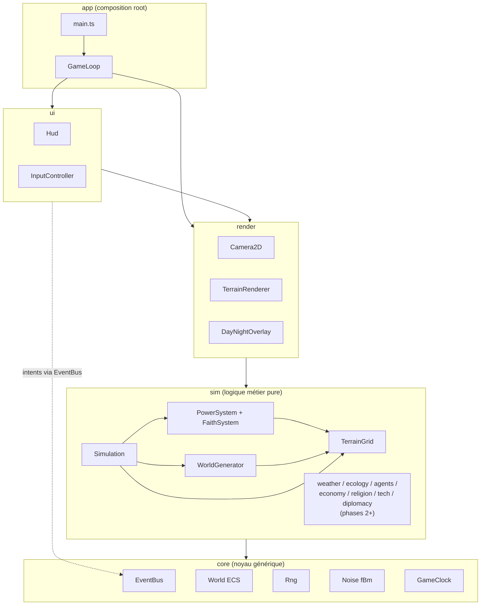
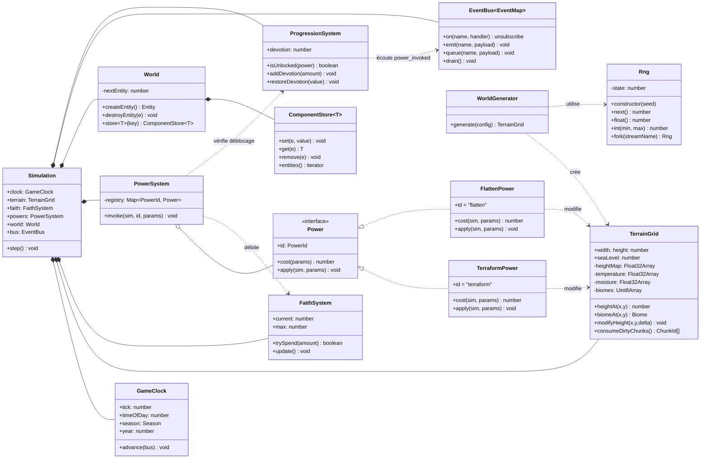
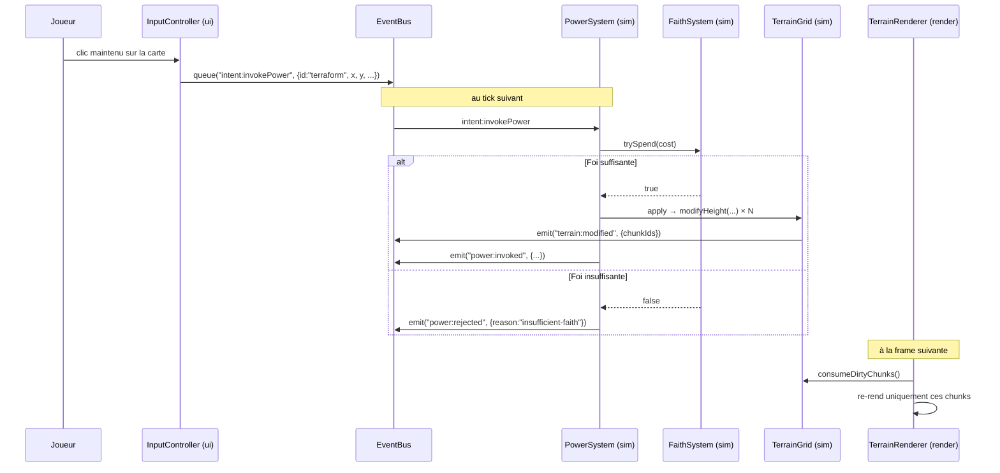
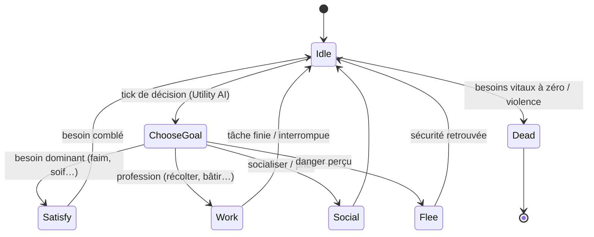

# ImG — Diagrammes UML

> Diagrammes en [Mermaid](https://mermaid.js.org/) — rendus nativement par GitHub.

## 1. Diagramme de composants (couches et dépendances)

Les flèches indiquent le **seul** sens de dépendance autorisé (vérifié par test d'architecture).



## 2. Diagramme de classes — noyau et MVP



## 3. Diagramme de séquence — un tick de simulation

```mermaid
sequenceDiagram
    participant RAF as requestAnimationFrame
    participant Loop as GameLoop (app)
    participant Sim as Simulation (sim)
    participant Bus as EventBus (core)
    participant Rend as Renderer (render)

    RAF->>Loop: frame(now)
    Loop->>Loop: accumulator += elapsed × speed
    loop tant que accumulator ≥ SIM_DT
        Loop->>Sim: step()
        Sim->>Sim: clock.advance() → time:dayStarted ?
        Sim->>Sim: powers (intents en attente)
        Sim->>Sim: faith.update()
        Sim->>Sim: systèmes futurs (météo, écologie, agents…)
        Sim->>Bus: drain() (événements différés)
    end
    Loop->>Rend: render(interpolation)
    Rend->>Sim: lecture seule (terrain, clock, faith)
    Rend->>Rend: redessine uniquement les chunks dirty
```

## 4. Diagramme de séquence — invocation d'un pouvoir divin



## 5. Diagramme d'états — agent habitant (phase 4, cadrage)


